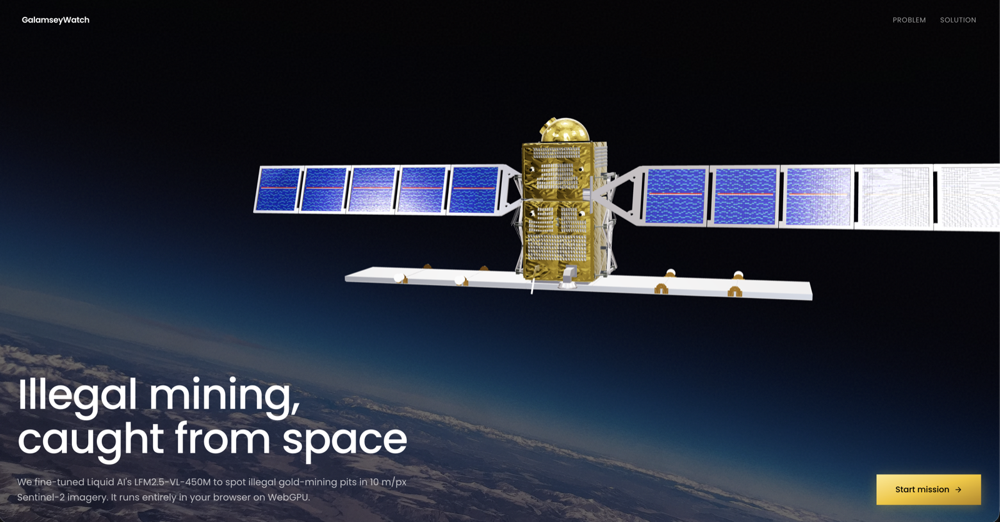
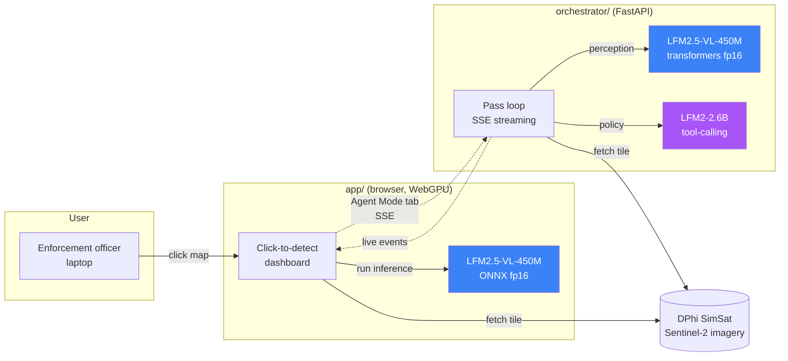

# GalamseyWatch



Two artifacts in one repo, both built around a fine-tuned vision-language model that detects illegal small-scale gold mining (galamsey) in Sentinel-2 imagery:

- **[`app/`](./app/)**: a browser-native dashboard that runs the VLM via WebGPU on an enforcement officer's laptop. Live at [galamseywatch.vercel.app](https://galamseywatch.vercel.app). Click the map; nothing leaves the device.
- **[`orchestrator/`](./orchestrator/)**: a FastAPI service that runs a two-layer agentic-EO pipeline (VLM perception + tool-calling LLM policy) over a simulated satellite pass and decides, per tile, what's worth downlinking.

The contribution of the orchestrator isn't the galamsey detector. That's the worked example. The contribution is the **architecture**: a four-interface contract (`VLMProvider`, `AgentPolicy`, `ImagerySource`, `Task`) that any fork can reskin in a single day for wildfire detection, illegal fishing, oil spills, etc.

---

## How the two artifacts compose



Both artifacts use the same fine-tuned `LFM2.5-VL-450M` (`samwell/galamsey-v9-e3-onnx` in browser, `samwell/galamsey-v9-e3` in Python). Same model, same prompts, two runtimes.

---

## Quickstart

```bash
# 1. Pull the v9-e3 weights (one-time, ~1 GB)
huggingface-cli download samwell/galamsey-v9-e3 \
  --local-dir orchestrator/checkpoints/galamsey-v9-e3

# 2. Run the orchestrator (port 8765)
cd orchestrator && uv sync
uv run uvicorn agentic_eo.main:app --port 8765

# 3. Run the dashboard in another terminal (port 3000)
cd app && npm install && npm run dev

# 4. Open localhost:3000/dashboard → "Agent Mode" tab → Initiate Pass
```

A typical 6-tile pass over a galamsey hotspot completes in ~5 minutes wall-clock.

---

## Read more

- **[orchestrator/README.md](./orchestrator/README.md)** for the orchestrator runbook (architecture, swap interfaces, env vars, event schema, fork instructions).
- **[app/README.md](./app/README.md)** for the browser dashboard runbook.
- **Live demo:** [galamseywatch.vercel.app](https://galamseywatch.vercel.app)

---

## License

MIT. See [LICENSE](./LICENSE).
