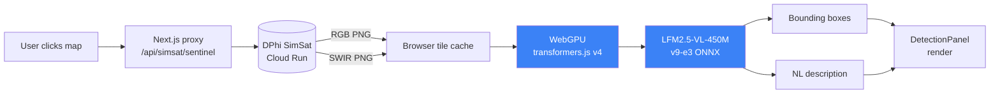

# GalamseyWatch: Browser dashboard

Browser-native vision-language model that detects illegal small-scale gold mining (galamsey) in Sentinel-2 satellite imagery. The fine-tuned LFM2.5-VL-450M (~1 GB ONNX, fp16) runs entirely in the browser via WebGPU. No backend, no API key, no imagery leaving the device.

**Live:** [galamseywatch.vercel.app](https://galamseywatch.vercel.app)

This is the dashboard half of the project. The agentic-EO orchestrator that talks to a simulated satellite lives in [`../orchestrator/`](../orchestrator/).

---

## Quickstart

```bash
npm install
npm run dev
# open http://localhost:3000/dashboard
```

The model weights (`samwell/galamsey-v9-e3-onnx`) are downloaded from Hugging Face on first visit (~1 GB, cached afterward). Subsequent clicks run inference in ~3–5 s on Apple Silicon or a discrete GPU.

---

## How a click becomes a detection



---

## Two modes (right pane)

- **Explore:** click anywhere on the Ghana map. Fetches a Sentinel-2 tile (RGB + SWIR composites) via DPhi's SimSat API, runs the VLM on WebGPU, renders bounding boxes + a natural-language scene description. Click any of 685 known mining sites (gold pins) for a one-tap detection.
- **Agent Mode:** runs a simulated satellite pass via the local orchestrator (`../orchestrator/`, port 8765 by default). The agent decides per tile whether to downlink, flag, or discard. Live thinking visualization streams as each tile completes.

A bitemporal swipe pane (2016 / 2018 / 2020 / 2022) lets you compare each detection against historical imagery: *gold* dots are persistent pits, *red* are new since past, *white outline* is past-only.

---

## Stack

- **Next.js 16** (App Router) with React 19
- **MapLibre GL** for the basemap
- **`@huggingface/transformers` v4** for browser-side VLM inference (WebGPU)
- **Three.js** for the landing-page hero (compressed Sentinel-1A model, ~2.6 MB GLB)
- **Tailwind v4** for styling
- **`framer-motion`** for streaming animations

---

## Browser requirements

- WebGPU support: Chrome / Edge 121+, Safari 17.2+, Firefox behind a flag.
- ~2 GB free GPU memory for the fp16 model. A `q4` fallback path exists for lower-VRAM devices but trades recall for fit.

The dashboard probes `navigator.gpu` on mount and shows a friendly *"open this page in desktop Chrome / Edge / Safari 17+"* card if WebGPU is unavailable, rather than failing silently at a stuck loading bar.

---

## Configuration

| Var | Default | Effect |
|---|---|---|
| `SIMSAT_URL` | `https://simsat-sim-…run.app` | DPhi SimSat endpoint the proxy route forwards to |
| `NEXT_PUBLIC_ORCHESTRATOR_URL` | `http://localhost:8765` | Orchestrator endpoint Agent Mode subscribes to |

---

## Layout

```
app/
├── public/                       static assets (mining_sites.json, sentinel.glb hero)
├── src/
│   ├── app/
│   │   ├── page.tsx              landing
│   │   ├── dashboard/page.tsx    click-to-detect dashboard with Explore + Agent tabs
│   │   ├── icon.tsx              favicon (gold gradient G via ImageResponse)
│   │   └── api/simsat/sentinel/  proxy route to DPhi SimSat (CORS-safe)
│   ├── components/
│   │   ├── Map.tsx               MapLibre basemap
│   │   ├── DetectionPanel.tsx    Explore-mode results pane
│   │   ├── AgentPanel.tsx        Agent-mode SSE consumer with live thinking card
│   │   ├── HeroScene.tsx         landing 3D scene
│   │   └── MapSearch.tsx         coordinate / town search
│   └── lib/
│       └── inference.ts          WebGPU model loading + grounding/description prompts
├── package.json
└── next.config.ts
```

---

## Deployment

Currently deployed via `vercel deploy` from this directory. See the parent [`README.md`](../README.md) for the project-wide quickstart and the agentic-EO orchestrator.
