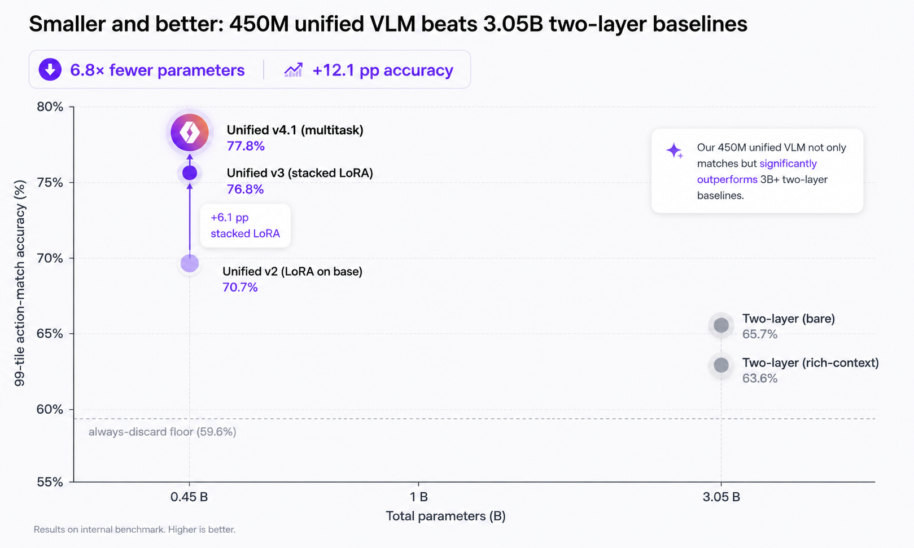
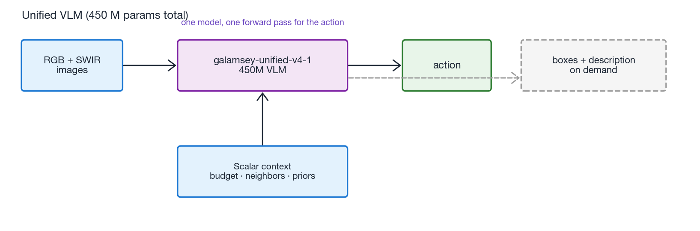
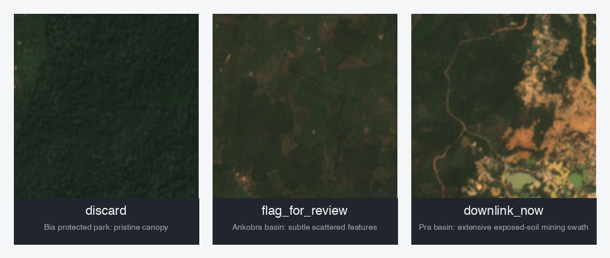

# On-Orbit Decision Policy for Bandwidth-Aware Satellite Tasking with a 450M Unified VLM



We fine-tuned a 450M LFM2.5-VL into a satellite-tasking policy that picks one of five actions per Sentinel-2 tile, given the imagery and a per-pass scalar context block. The unified model beats a 3.05B two-layer perception+policy reference system by **+12.1 pp** action-match accuracy on a 99-tile held-out evaluation, at **6.8x fewer parameters**. A single weight set produces the action, plus bounding boxes and a free-form scene description on demand; one model, three jobs.

This post is the experiment report: what we shipped, what we tried, what we found, and the warts that remain.

## Headline findings

* A 450M unified VLM replaced our 3.05B two-layer pipeline for on-orbit satellite tasking, with +12.1 pp action-match accuracy on the 99-tile held-out eval (77.8 % vs the strongest baseline at 65.7 %).
* The architectural advantage concentrated on the `flag_for_review` class: 0.89 recall vs 0.11 for the bare two-layer baseline. This is the class where ambiguous tiles need joint pixel + scalar-context reasoning that text descriptions tend to flatten.
* Stacking the action LoRA on top of `samwell/galamsey-v9-e3` (an existing perception fine-tune) instead of the bare LFM2.5-VL-450M base added +6.1 pp by itself. The perception backbone is doing real work.
* A first multitask SFT run that mixed action and perception examples 1:3 dropped action accuracy 7 pp because the action signal got drowned. Cutting perception examples to 1:0.7 of action recovered the gap and slightly exceeded the action-only model, while keeping v9-e3-quality grounding and description outputs from the same weights.

## What's in this post

1. Problem framing
2. System design
3. Data collection and labeling pipeline
4. Evaluation methodology
5. Baseline performance
6. Fine-tuning the action policy (v3)
7. Multitask SFT for full unification (v4.1)
8. Results

## 1. Problem framing

A satellite passing over Ghana sees many candidate Sentinel-2 tiles each pass. Most are negative: forest, water, savanna, urban, intact farmland. A few are active galamsey (illegal small-scale gold mining) sites with exposed lateritic soil, sediment plumes, and excavation pits. The downlink budget is limited to roughly six high-resolution tiles before exhaustion (we model this as 512 KB per pass, 80 KB per high-resolution downlink). The on-orbit autonomy needs to pick, per tile, what to do under that constraint.

The action vocabulary is five fixed tools:

| Action | Meaning |
|---|---|
| `discard` | skip the tile entirely |
| `flag_for_review` | log as text only, no image downlink, cheap follow-up |
| `request_higher_resolution` | request a higher-res recapture next pass |
| `request_neighbor_tile` | fetch the adjacent tile in a given compass direction |
| `downlink_now` | spend the bandwidth and send this tile to ground |

Picking the wrong `discard` wastes nothing. Picking the wrong `downlink_now` burns 80 KB of budget that cannot then go to a real galamsey detection later in the pass. The orchestrator is therefore a per-tile multi-class classifier with a verifiable cost structure.

We previously shipped this in [GalamseyWatch](https://github.com/samadon1/GalamseyWatch) as a two-layer pipeline: a 450M perception VLM ([`samwell/galamsey-v9-e3`](https://huggingface.co/samwell/galamsey-v9-e3)) emits bounding boxes plus a scene description, then a 2.6B text-only LFM2 policy reads those plus a scalar context block (downlink budget, neighbor decisions, mission priors) and picks the action. This worked, but the description string between the two layers is a bottleneck: visual cues that the perception VLM does not surface in prose cannot reach the policy. The question we set out to answer was: can a single 450M VLM, fine-tuned end-to-end, do better than the 3.05B two-layer split?

## 2. System design

### Why a unified VLM

The core argument for one model is that the description string is throwing away pixel information. When the perception VLM says "a small bright clearing near a stream bend", the policy LM cannot tell whether that clearing is a galamsey pit or a sandbar. The pixel evidence is gone by the time it reaches the decision. A unified model reads the pixels and the scalar context jointly, attends across them, and emits the action directly, with no intermediate text.

The cost is that one model has to be good at two jobs. A 450M VLM might not have the capacity to learn both perception (what does galamsey look like in RGB and SWIR?) and policy (when is the budget worth spending?) from a small labeled corpus. That is the question we test.

**Two-layer pipeline (3.05 B params total):**


The dashed box is the text bottleneck: visual cues that the perception VLM does not surface in the description string cannot reach the policy.

**Unified VLM (450 M params total):**



One model. One forward pass for the action. The same weights also emit bounding boxes and a description on demand (different prompt, different forward pass); so the on-ground analyst-review step that needs visualization-grade outputs collapses into the same model that ran on orbit.

### Why stack the policy LoRA on a perception fine-tune

The first thing we tried was a LoRA on the bare LFM2.5-VL-450M base (call it v2). It worked but only matched the two-layer baseline within noise. The reason is capacity: a small LoRA on the bare base has to learn perception (galamsey looks like exposed orange soil with bright SWIR) and policy (downlink only when budget allows and signal is unambiguous) from the same 327 oversampled training rows. The LoRA splits its capacity between the two jobs.

The fix is to stack the policy LoRA on top of an existing perception fine-tune. We use [`samwell/galamsey-v9-e3`](https://huggingface.co/samwell/galamsey-v9-e3) as the base. v9-e3 has already learned the perception representation from SmallMinesDS (4x D4 augmentation, full FT). The policy LoRA only needs to learn action selection on top of that frozen perception backbone. This is the [SMoLoRA](https://arxiv.org/abs/2411.10979) / [ColPro](https://arxiv.org/abs/2410.18816) stacked-adapter recipe applied to the agentic-EO setting.

The two effects are roughly additive in our results: the unified architecture (v2 vs rich-context two-layer) adds about 7 pp, and the stacked-pretraining (v3 vs v2) adds about 6 pp.

## 3. Data collection and labeling pipeline



The training corpus is 250 hand-labeled Sentinel-2 tiles published as [`samwell/galamsey-unified-decisions`](https://huggingface.co/datasets/samwell/galamsey-unified-decisions). Each row has:

* Two image composites: `rgb.png` (B4+B3+B2 natural color) and `swir.png` (B12+B11+B8 SWIR false-color, where bright pixels indicate exposed soil and mining disturbance).
* Per-tile metadata: `coord_id`, `lon`, `lat`, `stratum` (mining / forest / water / urban / mixed / edge), `mission_priors` (an AOI-specific operational note like *"Bibiani: known active galamsey cluster"*).
* Per-pass scalar context: `budget_remaining_kb`, `budget_total_kb`, `prior_tiles_downlinked`, `cloud_cover`, `captured_at`, `tile_imagery_issue`, and a structured `neighbor_summary` JSON object showing what each adjacent tile decided this pass.
* A target `action` (one of the five tool names) plus a free-form `reason`.

### Sampling

Coordinates come from a deterministic stratified sampler (seed 42) over 15 hand-curated AOIs across Ghana spanning all relevant strata: mining hotspots (Bibiani, Pra basin, Ankobra, Obuasi, Asutifi), forest reserves (Atewa, Kakum, Bia), water (Lake Bosumtwi, Lake Volta), urban (Accra, Kumasi), agricultural mosaic (northern savanna, central farmland), and a cloud-prone coastal edge (Coastal Axim). The sampler picks a stratum per fixed weights, an AOI within the stratum, and adds Gaussian jitter within each AOI's radius.

Imagery is fetched from the [DPhi SimSat](https://github.com/DPhi-Space/SimSat) simulator, which serves Sentinel-2 imagery as a satellite-pass simulator. Both the sampler and the fetcher are reproducible end-to-end:

```bash
cd training
uv run python scripts/fetch_unified_corpus.py 250
```

This caches RGB + SWIR PNGs and per-tile metadata under `training/data/unified_v1_cache/u0XXX/`.

### Labeling

The labels were produced by a single human labeler over multiple sessions, following a labeling protocol locked in three validation rounds (Bibiani positive controls, diverse-AOI sanity checks, edge cases). The system prompt for the labeler enforces several disambiguation rules that came out of those rounds:

* SWIR brightness in the absence of exposed-soil patterns is more likely infrastructure (rooftops, asphalt) than mining. Urban tiles have very bright SWIR but no pits.
* Rectilinear field patterns are agriculture, not mining. Galamsey pits are amorphous and cluster near water.
* If imagery is partial (large no-data regions, swath-edge artifacts) or heavily cloud-occluded regardless of metadata `cloud_cover`, prefer `flag_for_review` over `downlink_now`.
* When budget is below roughly 50 KB, downgrade an otherwise-confident `downlink_now` to `flag_for_review` so the lead is preserved for the next pass.

The class distribution after 250 labels is 58 % discard, 21 % flag, 19 % downlink, 2 % hires, 0 % neighbor. Discard dominates because Ghana's actual surface composition is mostly negative classes; the deterministic sampler reflects that base rate.

### Recurring data anomalies

The labeling surfaced two SimSat-side data defects worth knowing about:

* `cloud_cover = 1.403499` appears on every Coastal Axim tile in the corpus (18 tiles). The expected range is `[0, 1]`; the bit-identical out-of-range value across all 18 tiles indicates a deterministic upstream pipeline bug specific to that AOI. Mitigation: clamp `cloud_cover` to `[0, 1]` before consuming the field.
* Partial-tile black-bottom imagery appears on 5 Kakum tiles. The bottom 40-60 % of the tile is solid black; the top portion is valid forest. AOI-specific. Mitigation: detect via pixel statistics (fraction of `RGB = 0,0,0`) and treat as a `tile_imagery_issue`.

Both are useful out-of-distribution test cases for downstream consumers.

## 4. Evaluation methodology

We use **action-match accuracy** as the primary metric: did the predicted `action` literal equal the gold `action` literal? The metric is intentionally coarse; we do not grade the model on its `reason` text, only on whether the predicted action matches the gold action, because the action is the operational quantity. Which tile gets bandwidth this pass.

The evaluation set is 99 held-out Sentinel-2 tiles (39 from the original train/eval split + 60 newly labeled at indices the training set never saw, both drawn by the same deterministic sampler). Class breakdown: 59 discard, 18 flag, 21 downlink, 1 hires.

We compare five systems on this set:

1. **Always-discard floor**: the dummy policy that always emits `discard`. Captures the prior probability of the dominant class.
2. **Two-layer (bare)**: galamsey-v9-e3 perception + LFM2-2.6B policy with the original orchestrator prompt (perception output + budget only).
3. **Two-layer (rich-context)**: same models, but the LFM2 prompt is extended with `mission_priors` and `neighbor_summary` (the same scalar context the unified model sees). Isolates the architecture effect from the contextual contribution of richer prompts.
4. **Unified v3**: `galamsey-unified-v3` (450M, single model, action-only LoRA on `galamsey-v9-e3`). Intermediate result.
5. **Unified v4.1**: `galamsey-unified-v4-1` (450M, single model, multitask LoRA: action + grounding + description, same base). Headline result; trained later in Section 7.

Eval scripts are in [`training/scripts/eval_*_action_match_modal_expanded.py`](https://github.com/samadon1/GalamseyWatch/tree/main/training/scripts). All five run on Modal H100 with bf16 inference, greedy decoding, the same 99-tile JSONL.

## 5. Baseline performance

Running the bare two-layer baseline on the 99-tile eval gives **65.7 %** action-match accuracy. That is +6.1 pp above the always-discard floor, which sounds positive until you read the per-class recall: the bare two-layer catches every discard (1.00 recall) but only 2 of 18 flags (0.11 recall) and 4 of 21 downlinks (0.19 recall). It is essentially over-conservative, defaulting to `discard` whenever the perception emits zero bounding boxes, which is most of the time.

The rich-context two-layer (same models, extended prompt) scores **63.6 %**, statistically tied with the bare variant on this sample. The "richer context" prompt change closes some of the bare two-layer's conservatism (downlink recall climbs from 0.19 to 0.33) but does not lift the headline number. Adding `mission_priors` and `neighbor_summary` to the LFM2 prompt is roughly neutral on average across this distribution.

Both two-layer variants are already 3.05 B parameters: a 450 M perception VLM plus a 2.6 B text policy. Beating either with a 450 M unified model would mean roughly 6.8 x fewer parameters at higher accuracy.

## 6. Fine-tuning the action policy (v3)

We trained on Modal H100 using [`leap-finetune`](https://github.com/Liquid4All/leap-finetune).

### Dataset transformations

The training data is the 250-row corpus from [`samwell/galamsey-unified-decisions`](https://huggingface.co/datasets/samwell/galamsey-unified-decisions). Two transformations were essential.

**Action-only target.** Our v1 attempt used a `{"action": ..., "reason": ...}` assistant target of about 150 tokens. The model collapsed to `{discard, flag}` only and scored below the always-discard floor. The diagnosis: per-token cross-entropy was concentrating on reason-text fitting, and the action token was a tiny fraction of the gradient signal. We dropped the reason field, leaving `{"action": "<action_name>"}` (~15 tokens). That put 100 % of the loss on the prediction we actually care about.

**Class-balanced oversampling.** The 151-tile training set is 87 discard / 35 flag / 27 downlink / 2 hires. We oversampled the rare classes to roughly 80 each (discard stayed at 87; flag, downlink, hires were repeated up to 80; neighbor has zero unique examples and was skipped). The resulting 327-row training set is much closer to balanced.

Both transformations live in [`training/scripts/build_unified_v2_sft_dataset.py`](https://github.com/samadon1/GalamseyWatch/blob/main/training/scripts/build_unified_v2_sft_dataset.py); the script emits `galamsey_unified_v2_train.jsonl` (327 rows) and `galamsey_unified_v2_eval.jsonl` (39 rows held out).

### Training config

We used [`training/configs/galamsey_unified_v3_modal.yaml`](https://github.com/samadon1/GalamseyWatch/blob/main/training/configs/galamsey_unified_v3_modal.yaml):

```yaml
project_name: "galamsey-unified-v3-stacked-lora"
model_name: "/galamsey/lfm2.5-VL-450M-vlm_sft-galamsey_v-all-...-e3..."
training_type: "vlm_sft"

dataset:
  path: "/galamsey/data/unified_v2/galamsey_unified_v2_train.jsonl"
  type: "vlm_sft"
  test_size: 0.01
  image_root: "/galamsey/data/unified_v2/images"

training_config:
  extends: "DEFAULT_VLM_SFT"
  num_train_epochs: 15
  per_device_train_batch_size: 4
  per_device_eval_batch_size: 4
  gradient_accumulation_steps: 2
  learning_rate: 2e-5
  lr_scheduler_type: "cosine"
  warmup_ratio: 0.05
  eval_strategy: "epoch"
  save_strategy: "epoch"
  logging_steps: 5

peft_config:
  extends: "DEFAULT_VLM_LORA"
  use_peft: true
  r: 16
  lora_alpha: 32

modal:
  app_name: "galamsey-unified-v3-stacked"
  gpu: "H100"
  timeout: 7200
  output_volume: "galamsey"
  output_dir: "/galamsey"
  detach: false
```

Two design choices in the config matter:

* `model_name` points at the merged v9-e3 checkpoint on the Modal volume, not the bare LFM2.5-VL-450M. This is what makes the LoRA stacked rather than free-standing.
* `peft_config.r = 16` is double the `DEFAULT_VLM_LORA` rank of 8. Rank 8 underfit the policy on the larger context in our early runs; rank 16 was the smallest that didn't underfit.

### What the run looked like

Training reported `trainable params: 4,456,448 || all params: 520,284,160 || trainable %: 0.8565` after loading the v9-e3 base. Eval at epoch 0 came in at `eval_loss: 5.21`, much higher than the bare-base v2 baseline of 1.07; expected, since v9-e3 is biased toward emitting bounding-box JSON, which is far from `{"action": "discard"}`. The LoRA had to overcome that prior. By epoch 3 the loss broke through it; by epoch 7 train loss was essentially zero and eval loss plateaued around 0.001.

The merged final weights landed at `/galamsey/<long-run-name>/<long-run-name>-lora_m-<timestamp>` on the Modal volume. We published the merged model at [`samwell/galamsey-unified-v3`](https://huggingface.co/samwell/galamsey-unified-v3) on HuggingFace.

### Eval

Running the eval script ([`training/scripts/eval_unified_v3_action_match_modal_expanded.py`](https://github.com/samadon1/GalamseyWatch/blob/main/training/scripts/eval_unified_v3_action_match_modal_expanded.py)) on the 99-tile held-out set produced:

```
Action-match accuracy: 76/99 = 0.7677
Confusion matrix (rows=gold, cols=pred):
                    discard  downlink_now  flag_for_review  total
discard               47       3             9               59
flag_for_review        0       2            16               18
request_higher_resolution
                       0       0             1                1
downlink_now           1      13             7               21
```

76.8 % action-match accuracy, +11.1 pp over the strongest baseline. We held this as the working result while we investigated the next question: did the action-only training erase v9-e3's perception ability?

## 7. Multitask SFT for full unification (v4.1)

v3 had one wart we wanted to close: training on action-only target had partially overwritten v9-e3's perception ability. We confirmed this empirically; when we prompted v3 with the grounding prompt it emitted malformed JSON, and with the description prompt it hallucinated. In practice we still needed v9-e3 around for the on-ground analyst-review step that wants visualization-grade outputs. So we ran a multitask SFT experiment to collapse that second model away.

v4.1 used the same base and the same LoRA hyperparams as v3. The only change was the training corpus.

### The mixture

We mixed three task types into a single shuffled JSONL:

* **Action examples (327 rows)**: the same v2 oversampled corpus that v3 used.
* **Grounding examples (125 rows)**: sampled from the v9 perception SFT corpus. Target is bounding-box JSON.
* **Description examples (125 rows)**: same source, target is free-form scene description.

Total: 577 rows, action share 56.7 %. The builder is at [`training/scripts/build_unified_v4_1_multitask_dataset_modal.py`](https://github.com/samadon1/GalamseyWatch/blob/main/training/scripts/build_unified_v4_1_multitask_dataset_modal.py).

The reasoning behind the ratio: v9-e3 already knows perception well, so the perception subset is acting as a regulariser keeping the LoRA from overwriting that knowledge; we don't need to re-teach it from scratch. Our first attempt used 500 grounding + 500 description examples (action share 24.6 %). Perception held but action accuracy dropped 7 pp on the 99-tile holdout because the action signal was being drowned. We cut perception to 125 + 125 and re-ran.

### Training and eval

The config ([`galamsey_unified_v4_1_multitask_modal.yaml`](https://github.com/samadon1/GalamseyWatch/blob/main/training/configs/galamsey_unified_v4_1_multitask_modal.yaml)) is identical to v3 except for the dataset path:

```yaml
dataset:
  path: "/galamsey/data/unified_v4_1_multitask/galamsey_unified_v4_1_multitask_train.jsonl"
  image_root: "/galamsey/data/unified_v4_1_multitask/images"
```

Same r=16 / alpha=32 LoRA, same lr=2e-5, same 15 epochs. Training took about 13 minutes on H100; slightly less than v3 because the perception examples have shorter targets.

We then evaluated twice: once on the action policy (the same 99-tile holdout) and once on perception (a 100-tile sample drawn from the v9 grounding/description eval JSONLs, head-to-head against v9-e3):

```
# Action eval
Action-match accuracy: 77/99 = 0.7778

# Perception eval (head-to-head on 100 tiles)
v9     mIoU=0.337  box_count_match=25.00%  desc_BLEU=34.13
v4.1   mIoU=0.334  box_count_match=30.00%  desc_BLEU=33.18
```

v4.1 matched v9-e3 on perception within noise, and slightly exceeded v3 on action accuracy. One weight set was now sufficient for both jobs. We published the model at [`samwell/galamsey-unified-v4-1`](https://huggingface.co/samwell/galamsey-unified-v4-1).

## 8. Results

### Headline numbers

| System | Total params | 99-tile accuracy |
|---|---:|---:|
| Always-discard floor | n/a | 59.6 % |
| Two-layer (bare) | 3.05 B | 65.7 % |
| Two-layer (rich-context) | 3.05 B | 63.6 % |
| Unified v2 (LoRA on bare base) | 450 M | 70.7 % |
| Unified v3 (LoRA on `galamsey-v9-e3`, action-only target) | 450 M | 76.8 % |
| **Unified v4.1 (multitask LoRA: action + grounding + description)** | **450 M** | **77.8 %** |

`galamsey-unified-v4-1` is **+12.1 pp** over the strongest baseline, **+18.2 pp** over the floor, at **6.8 x fewer parameters** than either two-layer variant. Unlike v3, v4.1 also retains v9-e3's perception ability: on a 100-tile perception holdout, v4.1 matches v9-e3 within noise on grounding mean IoU (0.334 vs 0.337) and description BLEU (33.2 vs 34.1). One weight set is now sufficient for the on-orbit decision **and** the on-ground analyst review.

### Per-class recall

The architectural advantage is concentrated where it should be:


| Action | Bare two-layer | Rich-context two-layer | **Unified v4.1** |
|---|---:|---:|---:|
| `discard` (n = 59) | 1.00 | 0.78 | 0.86 |
| `flag_for_review` (n = 18) | 0.11 | 0.56 | **0.89** |
| `downlink_now` (n = 21) | 0.19 | 0.33 | **0.48** |
| `request_higher_resolution` (n = 1) | 0.00 | 0.00 | 0.00 |

The 78 pp `flag_for_review` recall gap (0.89 vs 0.11) is the cleanest single-class evidence of the unified architecture. Flag is the class where the gold label is most sensitive to subtle visual cues that a perception VLM's text description tends to flatten: a thin orange linear feature on a dense-forest tile, a small bright clearing in otherwise pristine canopy, a settlement-edge pattern that is neither full mining nor clean farmland. The unified model reads those cues directly off the pixels alongside the scalar context. The two-layer architecture has to compress them through the description string first.

The figure below shows this concretely on three held-out tiles. Each panel is one tile with v4.1's actual outputs, bounding boxes from the grounding prompt, description from the description prompt, action from the policy prompt, all from the same weight set. The middle panel is the architectural-advantage case: when prompted for boxes, v4.1 says "0 boxes, no signs of galamsey." When prompted for the action, v4.1 still emits `flag_for_review` because the same weights read subtle scattered surface features and the scalar mission priors jointly with the pixels. A two-layer system reading v4.1's description string alone would discard this tile - but in the unified architecture, the policy never has to go through the description string in the first place.


A note on the on-orbit cost model. Only the action prompt runs in the per-pass decision path, so per-tile cost on orbit is one forward pass over a 450 M model. The grounding and description outputs are produced on the ground for the small subset of tiles that v4.1 chose to downlink, using the same weights that already shipped with the satellite. The 6.8 x parameter reduction relative to the two-layer baseline holds in both regimes.

`request_higher_resolution` recall is 0.00 across all systems. There is only one hires example in the held-out set and only two unique hires examples in the training set (oversampled to 80 by repetition, which the model memorized rather than generalized). This class needs deliberate hand-construction, not just oversampling. Same story for `request_neighbor_tile`, which has zero examples anywhere in the corpus.

### What the wins decompose into

A more careful read of the table separates three effects:

* **Architecture effect** (v2 vs rich-context two-layer): about +7 pp. The unified model's joint pixel + context reasoning shows up on flag and downlink, where text descriptions flatten subtle visual cues.
* **Stacked-pretraining effect** (v3 vs v2): about +6 pp. Pre-installing perception in the LoRA's base frees the policy LoRA to spend all 4.5 M trainable parameters on action selection rather than relearning what galamsey looks like.
* **Multitask-mixture effect** (v4.1 vs v3): about +1 pp on action accuracy, plus full retention of v9-e3-quality grounding and description outputs from the same weights. The perception examples in the mixture act as a regulariser that keeps the LoRA from overwriting v9-e3's perception, with no measurable cost to action accuracy at the right ratio.

The first two contributions hold across two independent eval samples (a 39-tile initial sample and the 99-tile expanded sample we trust as the headline). The multitask effect was measured on the 99-tile sample only.

## What's next

Three open follow-ups, in increasing order of effort:

* **Larger and disjoint-AOI eval.** The 99 held-out tiles come from the same 15 AOIs as the training set, just at indices the train set never saw. An eval set drawn from disjoint AOIs would test out-of-distribution generalization, not just same-distribution robustness.
* **Hand-constructed rare-class data.** `request_higher_resolution` and `request_neighbor_tile` are at 0 % recall and need data not heuristic oversampling. The hires class needs subtle-candidate tiles that genuinely need more pixels to confirm. The neighbor class needs cluster-edge tiles where a feature continues off-frame in a known direction. Both are best produced by deliberate cropping of known-mining tiles.
* **GRPO post-SFT.** Action-match has a verifiable reward, which is exactly what GRPO is good at amplifying. We attempted this and documented three integration gaps between trl 1.3.0's multimodal GRPOTrainer and LFM2.5-VL's processor and attention pipeline (`spatial_shapes` not in the trainer's vision-kwargs allowlist; SigLIP2 SDPA cuDNN failure under variable batch shapes; bidirectional-mask shape error in the SigLIP2 encoder). The first is a clean ~30-line patch. The third needs an upstream transformers fix. See the [GRPO investigation in the repo](https://github.com/samadon1/GalamseyWatch/blob/main/training/scripts/train_unified_v4_grpo_modal.py) for the documented findings.

## Resources

* Repository: [`samadon1/GalamseyWatch`](https://github.com/samadon1/GalamseyWatch)
* Unified model (multitask, headline result): [`samwell/galamsey-unified-v4-1`](https://huggingface.co/samwell/galamsey-unified-v4-1)
* Unified model (action-only, intermediate result): [`samwell/galamsey-unified-v3`](https://huggingface.co/samwell/galamsey-unified-v3)
* Dataset: [`samwell/galamsey-unified-decisions`](https://huggingface.co/datasets/samwell/galamsey-unified-decisions)
* Perception base: [`samwell/galamsey-v9-e3`](https://huggingface.co/samwell/galamsey-v9-e3)
* Live demo of the perception layer (browser, WebGPU): [galamseywatch.vercel.app](https://galamseywatch.vercel.app)
