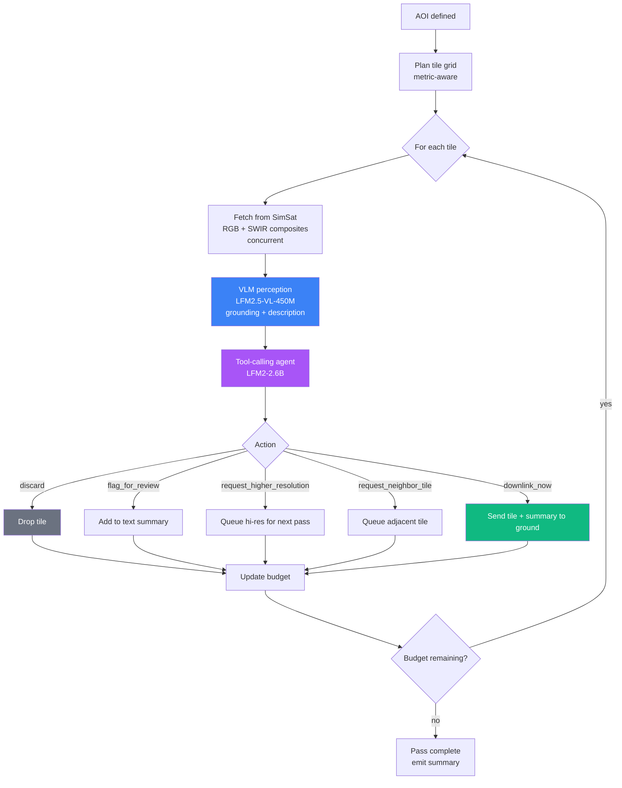
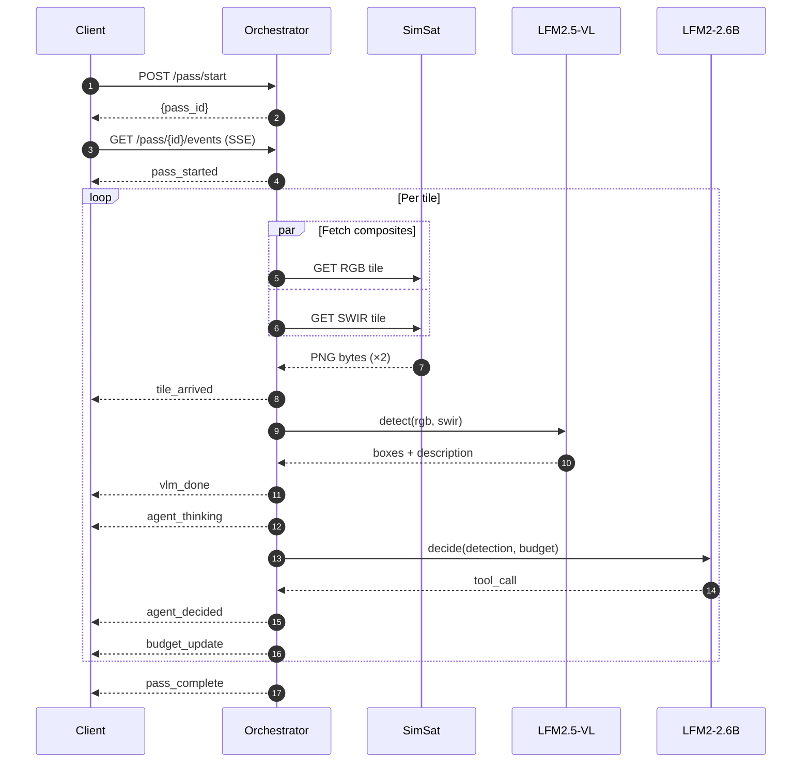

# agentic-eo orchestrator

A reference template for **two-layer agentic Earth Observation on satellite-class compute**: a vision-language model for perception, plus a tool-calling LLM for policy, running over a simulated satellite pass and deciding (per tile) what's worth downlinking.

The fundamental bottleneck of Earth observation isn't perception, it's bandwidth. Satellites collect orders of magnitude more imagery than they can downlink. The industry default ("send everything home, process on the ground") is slow, wasteful, and hard-coded. Onboard agentic reasoning inverts that: process up there, downlink decisions and summaries.

This is the **template**, not a one-off galamsey demo. Galamsey detection is the worked example; the contribution is the architecture. Four swap interfaces (`VLMProvider`, `AgentPolicy`, `ImagerySource`, `Task`) make it forkable in a single day for wildfire detection, illegal fishing, oil spills, deforestation alerts.

**Reference stack:** [`LFM2.5-VL-450M`](https://huggingface.co/LiquidAI/LFM2.5-VL-450M) (perception, fine-tuned on galamsey) + [`LFM2-2.6B`](https://huggingface.co/LiquidAI/LFM2-2.6B) (tool-calling policy) + [DPhi Clustergate-2 SimSat](https://github.com/DPhi-Space/SimSat) (imagery + orbit propagation).

The dashboard half of this project (browser-native click-to-detect VLM, deployed at [galamseywatch.vercel.app](https://galamseywatch.vercel.app)) lives in [`../app/`](../app/).

---

## Quickstart

```bash
# 1. Pull the v9-e3 VLM weights (~1 GB, one-time)
huggingface-cli download samwell/galamsey-v9-e3 \
  --local-dir checkpoints/galamsey-v9-e3

# 2. Install Python deps (uv-managed)
uv sync

# 3. Start the FastAPI service
uv run uvicorn agentic_eo.main:app --port 8765
```

The agent's `LFM2-2.6B` weights download from Hugging Face on first `/pass/start` call (~5 GB, cached at `~/.cache/huggingface/`).

Run a 6-tile pass over the Bibiani galamsey cluster:

```bash
curl -X POST http://localhost:8765/pass/start \
  -H "Content-Type: application/json" \
  -d '{
    "aoi": {"name": "Bibiani cluster", "lon_min": -2.79, "lat_min": 5.62, "lon_max": -2.71, "lat_max": 5.66},
    "tile_count": 6,
    "mode": "agent",
    "bandwidth_kb": 512
  }'
```

Stream the live SSE event log:

```bash
curl -N http://localhost:8765/pass/<pass_id>/events
```

For the visual experience, run the parent dashboard (`../app/`), open `localhost:3000/dashboard`, click the **Agent Mode** tab, hit **Initiate Pass**.

---

## Architecture

The pass loop iterates over a planned tile grid. For each tile, imagery flows through perception, then policy, then the action gets applied to the bandwidth budget.



**Layer 1 (Perception).** Concurrent SimSat fetches for the RGB and SWIR composites of each tile. Sending only RGB tanks recall by ~20pp; the SWIR composite is what makes pits visually pop. The VLM is called twice per tile: once with the grounding prompt (returns a JSON list of bounding boxes), once with the description prompt (returns a one-paragraph scene description). Same fine-tuned weights, same prompts as the production browser dashboard at [galamseywatch.vercel.app](https://galamseywatch.vercel.app); the orchestrator and the browser are *the same model on the same imagery, just two runtimes*.

**Layer 2 (Policy).** The `LFM2-2.6B` agent receives a structured tile context (lon/lat, cloud cover, captured-at, box count, max box area, description, derived confidence, bandwidth remaining) and is asked to call exactly one of five tools: `discard`, `flag_for_review`, `request_higher_resolution`, `request_neighbor_tile`, or `downlink_now`.

### Streaming event protocol

Server-Sent Events drive both the live dashboard *and* the eval harness. One format, two consumers:



The `agent_thinking` / `agent_decided` split is deliberate: thinking is the *visualization* channel (what the model is reasoning about); decided is the *decision* channel (the structured tool call). The eval harness ignores thinking; the dashboard uses it for the live spinner.

---

## The four swap interfaces

What makes this a template rather than a one-off demo: four small interfaces, each constrained to a single file, that any fork can replace independently. If swapping any of them requires touching `pass_runner.py`, the abstraction has leaked.

| Interface | Default | Swap targets |
|---|---|---|
| **`VLMProvider`** <br/> `detect(rgb, swir) → boxes, description, confidence` | `LFM2.5-VL-450M` with v9-e3 fine-tune | OlmoEarth, GeoChat, RemoteCLIP, base `LFM2.5-VL` |
| **`AgentPolicy`** <br/> `decide(detection, context, budget) → action` | `LFM2-2.6B` tool-calling | threshold-on-confidence, rule-based, larger LLM |
| **`ImagerySource`** <br/> `fetch_tile(lon, lat, bands)` | DPhi SimSat client | Sentinel-Hub, Planet, on-orbit feed, file-system fixtures |
| **`Task`** <br/> prompts + eval set + success criteria | galamsey (v9 prompts, SmallMinesDS-derived eval) | wildfire, illegal fishing, oil spill, deforestation |

---

## Demo result: Bibiani galamsey cluster

A 6-tile pass over `lon=[-2.79, -2.71], lat=[5.62, 5.66]`, the densest cluster of v9-confirmed sites in the Bibiani forest belt:

| Metric | Value |
|---|---|
| Tiles correctly downlinked | **5 of 6** |
| Tiles correctly discarded | 1 of 6 |
| Bandwidth spent | 400 KB / 512 KB |
| Wall-clock | ~272 s (~4.5 min) |
| Cumulative galamsey area flagged | **~45 hectares** |

The agent's reasoning streams live, e.g.:

> *"5 mining pits identified, scattered across the scene. The largest lies in the lower-left quadrant. 12.46 total hectares affected"* → DOWNLINK.

> *"No mining activity detected, undisturbed land"* → DISCARD.

---

## Performance characteristics

Reference machine: 16 GB unified-memory Mac, Apple Silicon, MPS via PyTorch fp16. The pipeline auto-selects CUDA → MPS → CPU. CPU is functional but slow (~minutes per tile); a discrete GPU or Apple Silicon is recommended.

| Stage | Cold | Warm |
|---|---|---|
| VLM model load (~990 MB on disk) | ~2 s | n/a |
| VLM single tile (RGB + SWIR fetch + 2 prompts) | ~9 s | ~3 s |
| Agent model load (~5 GB on disk) | ~8 s | n/a |
| Agent single decision (~30–50 output tokens) | ~30 s (incl. load) | ~13 s |
| SimSat fetch single tile | ~0.5–10 s | varies |
| Per-tile total in steady state | n/a | **~16 s** |
| Full 6-tile pass | n/a | **~5 min** |
| Full 20-tile pass | n/a | ~5–6 min |

**Memory:** VLM (450M, fp16) ≈ 0.9 GB · agent (2.6B, fp16) ≈ 5.2 GB · torch overhead ≈ 1 GB. Total ≈ 7 GB on MPS, fits 16 GB unified memory comfortably.

---

## Configurable

Five environment variables let you swap models, toolsets, or imagery without code changes:

| Var | Default | Effect |
|---|---|---|
| `LFM2_AGENT_MODEL` | `LiquidAI/LFM2-2.6B` | Swap the agent (e.g. for ablation against `LFM2.5-1.2B-Instruct`) |
| `AGENT_TOOLSET` | `full` | `minimal` collapses to three tools (discard / flag / downlink). Strips the active-observation actions. |
| `SIMSAT_BASE_URL` | DPhi Cloud Run | Point at a self-hosted SimSat or different imagery source |
| `GALAMSEY_VLM_PATH` | `./checkpoints/galamsey-v9-e3` | Override the VLM checkpoint location |
| `LOG_LEVEL` | `INFO` | Standard Python logging level |

---

## REST endpoints

| Method | Path | Purpose |
|---|---|---|
| `POST` | `/pass/start` | Kick off a pass over an AOI; returns `{pass_id}` |
| `GET` | `/pass/{id}/events` | SSE stream of pass events |
| `GET` | `/pass/{id}/summary` | Final summary (404 if pass not started, 409 if not yet complete) |
| `GET` | `/pass/{id}/tile/{tid}/image` | Serve cached PNG for a tile |
| `GET` | `/` | Health check |

### Event types

| event | meaning |
|---|---|
| `pass_started` | aoi, tile_count, bandwidth_kb, mode |
| `tile_arrived` | tile_id, lon, lat, image_url, cloud_cover, captured_at |
| `vlm_done` | tile_id, detection (boxes + description + confidence), inference_ms |
| `agent_thinking` | tile_id, scratchpad (visualization channel) |
| `agent_decided` | tile_id, action, reasoning, decision_ms |
| `budget_update` | bandwidth_used_kb, bandwidth_remaining_kb |
| `pass_complete` | summary (tile counts, descriptions, totals) |
| `ping` | keep-alive on 15 s of silence |

---

## Layout

```
agentic_eo/
  main.py           FastAPI app + 5 routes + logging config
  schema.py         Pydantic models for requests / events / summary
  events.py         SSE encoding helpers
  store.py          In-memory pass state + tile-image cache
  pass_runner.py    Async pass loop (the contract)
  aoi.py            Metric-aware grid tile planner
  simsat_client.py  Async httpx client to DPhi SimSat
  models/
    vlm.py          LFM2.5-VL wrapper (singleton, lazy-load, asyncio.Lock-serialized)
    agent.py        LFM2-2.6B tool-calling wrapper (singleton, lazy-load)
checkpoints/
  galamsey-v9-e3/   VLM weights (gitignored; pull via huggingface-cli)
```

Phase 2 will add `eval/` (the ablation harness, replays the same SSE event log offline). Phase 3 will pull the example task into `tasks/galamsey.py` to make the `Task` swap one file.

---

## Forking for a different task

Three small changes:

1. **Replace the example task.** Drop in your own dataset and fine-tuned VLM. The grounding prompt should expect bounding boxes + a description; the description prompt expects natural-language scene context. Override `GALAMSEY_VLM_PATH` to point at your checkpoint.
2. **Tune the system prompt** in `agentic_eo/models/agent.py`. Change the mission framing from galamsey to your domain (e.g. *"detect active wildfire fronts in MODIS thermal imagery"*).
3. **Choose your tools.** Keep the five-action space, or trim to the three-action minimal set in `_MINIMAL_TOOLS` via `AGENT_TOOLSET=minimal`. The 5-tool space buys you `request_higher_resolution` and `request_neighbor_tile` (active-observation actions) at the cost of needing a more-capable agent to commit consistently.

Most forks should be a single-day exercise.

---

## What this is NOT

- **Not a polished one-shot galamsey detector.** That's the dashboard above. The orchestrator is the *template*; galamsey is the worked example.
- **Not a new geospatial foundation model.** Uses existing fine-tuned weights and existing instruction-tuned base models.
- **Not hardware/systems work.** The DPhi stack is taken as given.
- **Not gated on real flight time.** SimSat is the substrate; flight credits on Vigoride 7 (early 2026) would be a bonus, not a requirement.
- **Not optimizing for accuracy on galamsey.** That's the v9 model's job. The orchestrator's question is whether an agent loop reduces downlink bandwidth at fixed recall.

---

## License

MIT, see [`../LICENSE`](../LICENSE).
